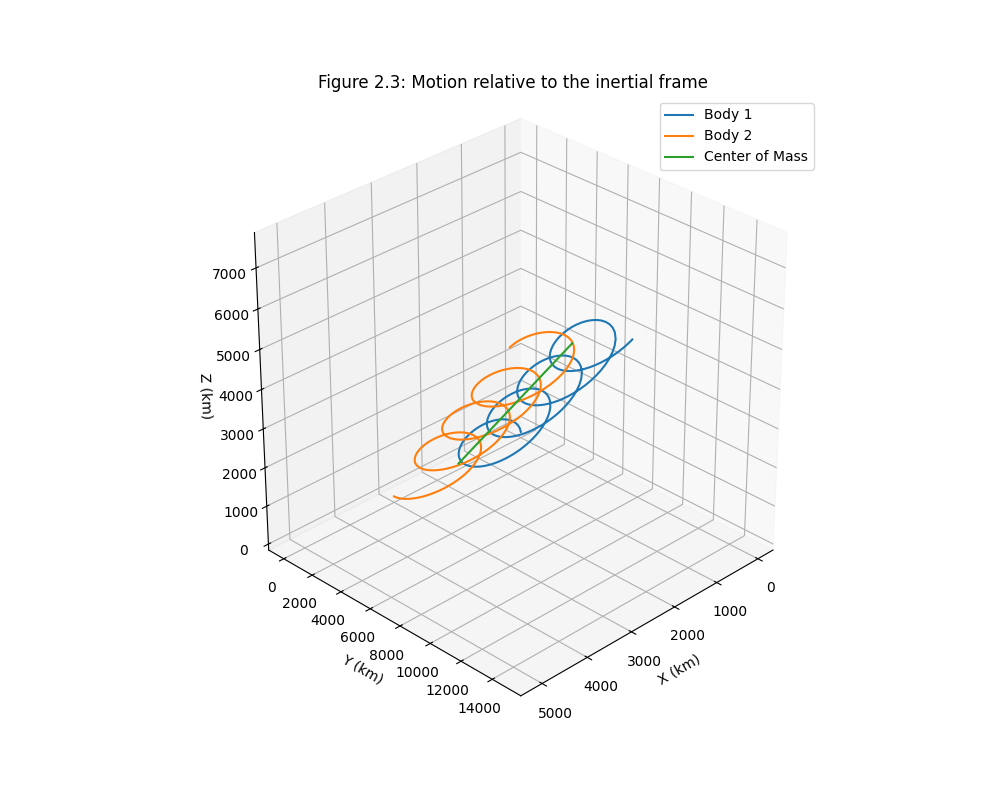
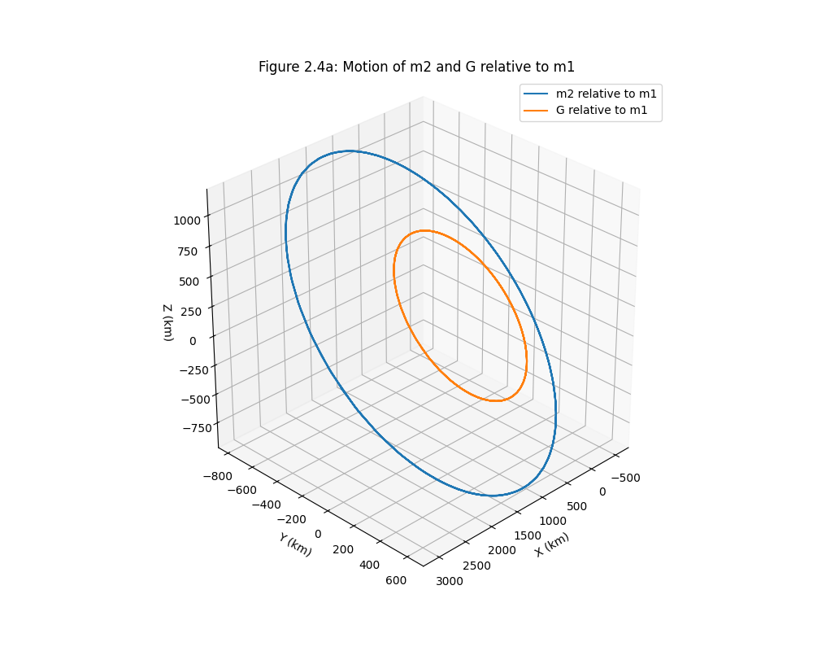
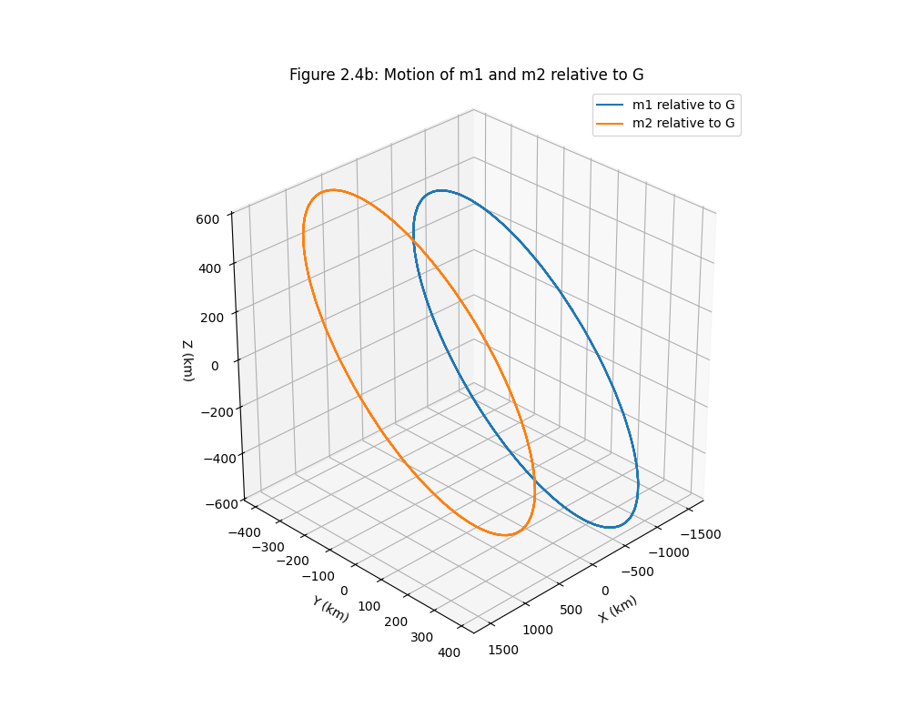

# Two-Body 3D Orbital Simulation with RKF45

A modular C++ orbital mechanics simulator using the adaptive Runge-Kutta-Fehlberg 4(5) numerical integration method.

This project simulates the motion of two gravitating bodies in three-dimensional space and visualizes the trajectories using Python and Matplotlib.

---

# Features

- Adaptive RKF45 integrator
- State-based simulation architecture
- Modular C++ project structure
- 3D inertial-frame orbital propagation
- Relative motion visualization
- Center-of-mass (barycenter) analysis
- CSV trajectory export
- Python plotting pipeline

---

# Project Structure

```text
twoBody3D-rkf45-tiff/
│
├── include/
│   ├── integrators/
│   ├── physics/
│   └── utils/
│
├── src/
│   ├── integrators/
│   ├── physics/
│   └── utils/
│
├── scripts/
│   └── plot_trajectory.py
│
├── output/
│   └── trajectory.csv
│
├── results/
│   ├── inertial_frame.png
│   ├── relative_motion.png
│   └── barycenter_motion.png
│
├── CMakeLists.txt
└── README.md
```

---

# Numerical Method

The simulation uses the Runge-Kutta-Fehlberg 4(5) method with adaptive timestep control.

The RKF45 stage equations are:

\[
k_i=f\left(t+a_i h,\ y+h\sum_{j=1}^{i-1} b_{ij}k_j\right)
\]

The local truncation error is estimated from the difference between the 4th-order and 5th-order solutions.

---

# Build Instructions

## Requirements

- C++17
- CMake
- Python 3
- NumPy
- Matplotlib

## Compile

```bash
mkdir -p build
cd build
cmake ..
make
```

## Run Simulation

```bash
./orbital_sim
```

The simulation outputs:

```text
output/trajectory.csv
```

---

# Plotting Results

Run the Python visualization script:

```bash
python scripts/plot_trajectory.py
```

---

# Sample Results

## Motion Relative to the Inertial Frame



---

## Relative Motion of m2 Relative to m1



---

## Motion Relative to the Barycenter



---

# Physics Model

The simulator solves Newtonian gravitational motion:

\[
\mathbf{F}=G\frac{m_1m_2}{r^2}
\]

with equations of motion propagated numerically in Cartesian coordinates.

---

# Future Extensions

Potential future upgrades:

- Restricted three-body dynamics
- J2 perturbations
- Atmospheric drag
- Low-thrust propulsion
- Formation flying
- Monte Carlo trajectory analysis
- Symplectic integrators
- GPU acceleration

---

# Author

Xing (Tiffany) Chen

